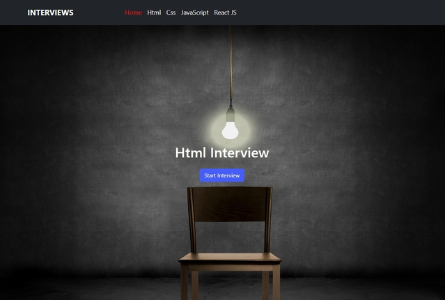
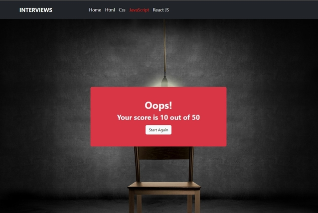

# Interviews App

This project Live Domain [Interviews](https://bola-nabil.github.io/Interviews/).

## Skills used in the project
- HTML
- CSS
- JavaScript
- BootStrap
- React
- React Routing
- React Redux
- Redux Toolkit

You can start Project
```
npm start
```
Runs the app in the development mode.\
Open [http://localhost:3000](http://localhost:3000) to view it in your browser.

### Home page App


### Start Interview


### Questions


### The Result Page

